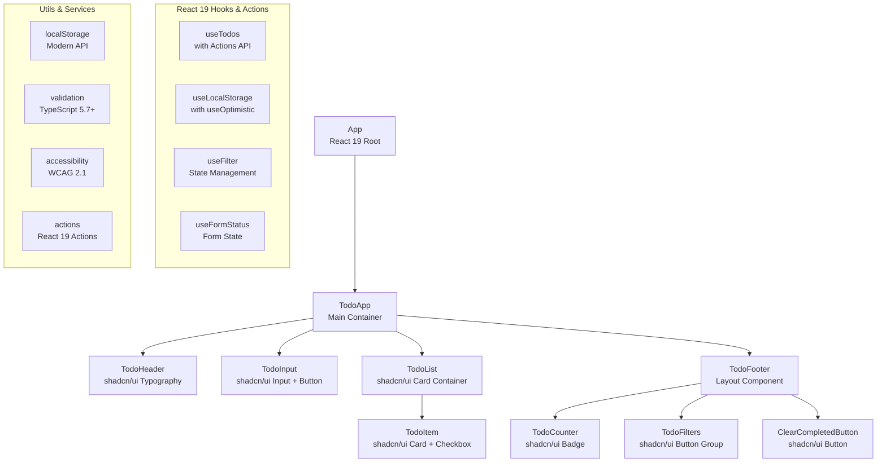

# 技術設計書

## 概要とアーキテクチャ決定

### プロジェクト概要
最新技術スタックを活用したモダンなウェブベースのTODOアプリケーションの技術設計書です。React 19（Actions API、コンカレント機能）、TypeScript 5.7+（ECMAScript 2024対応）、Tailwind CSS 4.0+（カスケードレイヤー、コンテナクエリ）、shadcn/ui 3.0+（namespaced registries）、Vite 7.0+（ESM専用配布）、Local Storage（モダンブラウザネイティブ）を使用して、WCAG 2.1準拠の高性能でアクセシブル、かつ美しいUIを持つタスク管理システムを構築します。

### 技術スタック決定根拠

```mermaid
graph TB
    subgraph "Frontend Stack 2025"
        A[React 19<br/>Actions API & Concurrent Features] --> B[TypeScript 5.7+<br/>ECMAScript 2024]
        B --> C[Tailwind CSS 4.0+<br/>Cascade Layers & Container Queries]
        C --> D[shadcn/ui 3.0+<br/>Namespaced Registries]
        D --> E[Local Storage<br/>Modern Browser Native]
    end
    
    subgraph "Build & Development Tools"
        F[Vite 7.0+<br/>ESM-only & 5x Faster] --> G[ESLint 9+<br/>Flat Config]
        G --> H[Prettier 3+<br/>TypeScript 5.7 Support]
        H --> I[Vitest 2+<br/>Browser Mode]
    end
    
    subgraph "Quality Assurance"
        J[React Testing Library<br/>React 19 Support] --> K[Playwright<br/>Component Testing]
        K --> L[TypeScript 5.7+ Strict<br/>ECMAScript 2024]
        L --> M[Lighthouse<br/>Core Web Vitals]
    end
```



#### フロントエンド技術選択（最新バージョン）
- **React 19**: Actions API、Server Actions、useOptimistic、useFormStatus、改善されたエラーバウンダリ、自動メモ化コンパイラによる最高レベルのパフォーマンス
- **TypeScript 5.7+**: ECMAScript 2024対応（Promise.withResolvers、Object.groupBy、Map.groupBy）、より厳格な型チェック、SharedArrayBuffer/ArrayBuffer対応
- **Tailwind CSS 4.0+**: Oxideエンジンによる5倍高速ビルド、ネイティブカスケードレイヤー、コンテナクエリ、@propertyアニメーション、color-mix()サポート
- **shadcn/ui 3.0+**: namespaced registries、プライベートレジストリ、改善されたCLI、Button・Input・Checkbox・Card・Badge・Alert・Toast等の美しいコンポーネント
- **Vite 7.0+**: ESM専用配布、Node.js 20.19+要件、100倍高速インクリメンタルビルド、baseline-widely-availableブラウザターゲット
- **Local Storage**: モダンブラウザネイティブ実装、オフライン完全対応、セッション間データ永続化

## システムアーキテクチャ

### React 19 + shadcn/ui コンポーネントアーキテクチャ



### React 19 Actions API 状態管理戦略

```typescript
// React 19 Actions を活用した状態設計
interface TodoState {
  todos: Todo[]
  filter: FilterType
  editingId: string | null
  optimisticTodos: Todo[] // useOptimistic用
  isSubmitting: boolean // Actions API用
}

// ローカル状態管理パターン
type FilterType = 'all' | 'active' | 'completed'

interface Todo {
  id: string
  text: string
  completed: boolean
  createdAt: Date
  updatedAt: Date
  optimisticId?: string // 楽観的更新用
}

// React 19 Actions定義
type TodoAction = 
  | { type: 'ADD_TODO'; payload: string }
  | { type: 'TOGGLE_TODO'; payload: string }
  | { type: 'EDIT_TODO'; payload: { id: string; text: string } }
  | { type: 'DELETE_TODO'; payload: string }
  | { type: 'CLEAR_COMPLETED' }
```

## データモデル設計

### TypeScript 5.7+ ECMAScript 2024型定義

```typescript
// Core Types with TypeScript 5.7+ features
export interface Todo {
  id: string
  text: string
  completed: boolean
  createdAt: Date
  updatedAt: Date
  optimisticId?: string // React 19 useOptimistic用
}

// ECMAScript 2024 グルーピング用型
export type TodoGroup = ReturnType<typeof Object.groupBy<Todo, string>>
export type TodoMap = ReturnType<typeof Map.groupBy<Todo, FilterType>>

export type FilterType = 'all' | 'active' | 'completed'

export interface TodoState {
  todos: Todo[]
  filter: FilterType
  editingId: string | null
}

// API Types for Local Storage
export interface StorageData {
  todos: Todo[]
  version: string
}

// Component Props Types with React 19 Actions
export interface TodoItemProps {
  todo: Todo
  toggleAction: (formData: FormData) => Promise<void> // React 19 Action
  editAction: (formData: FormData) => Promise<void> // React 19 Action  
  deleteAction: (formData: FormData) => Promise<void> // React 19 Action
  onStartEdit: (id: string) => void
  onCancelEdit: () => void
  isEditing: boolean
  isPending?: boolean // useFormStatus用
}

export interface TodoInputProps {
  onAdd: (text: string) => void
  placeholder?: string
  className?: string
}

export interface TodoFilterProps {
  currentFilter: FilterType
  onFilterChange: (filter: FilterType) => void
  className?: string
}

// React 19 Hook Return Types with Actions API
export interface UseTodosReturn {
  todos: Todo[]
  optimisticTodos: Todo[] // useOptimistic
  filter: FilterType
  editingId: string | null
  // React 19 Actions
  addTodoAction: (formData: FormData) => Promise<void>
  toggleTodoAction: (formData: FormData) => Promise<void>
  editTodoAction: (formData: FormData) => Promise<void>
  deleteTodoAction: (formData: FormData) => Promise<void>
  clearCompletedAction: () => Promise<void>
  // Standard functions
  setFilter: (filter: FilterType) => void
  startEdit: (id: string) => void
  cancelEdit: () => void
  // Computed values with ECMAScript 2024
  filteredTodos: Todo[]
  groupedTodos: TodoGroup // Object.groupBy結果
  activeTodoCount: number
  completedTodoCount: number
  isPending: boolean // Action pending state
}

export interface UseLocalStorageReturn<T> {
  data: T
  setData: (value: T) => void
  loading: boolean
  error: string | null
}
```

### データ検証スキーマ

```typescript
// Data Validation Utilities
export const validateTodo = (todo: unknown): todo is Todo => {
  if (!todo || typeof todo !== 'object') return false
  
  const t = todo as any
  return (
    typeof t.id === 'string' &&
    typeof t.text === 'string' &&
    typeof t.completed === 'boolean' &&
    t.createdAt instanceof Date &&
    t.updatedAt instanceof Date
  )
}

export const validateStorageData = (data: unknown): data is StorageData => {
  if (!data || typeof data !== 'object') return false
  
  const d = data as any
  return (
    Array.isArray(d.todos) &&
    d.todos.every(validateTodo) &&
    typeof d.version === 'string'
  )
}
```

## コンポーネント設計

### React 19 Hooks & Actions 実装

```typescript
// useTodos Hook with React 19 Actions API
import { useOptimistic, startTransition } from 'react'

export const useTodos = (): UseTodosReturn => {
  const [todos, setTodos] = useLocalStorage<Todo[]>('todos', [])
  const [optimisticTodos, setOptimisticTodos] = useOptimistic(todos)
  const [filter, setFilter] = useState<FilterType>('all')
  const [editingId, setEditingId] = useState<string | null>(null)
  const [isPending, setIsPending] = useState(false)

  // React 19 Action for adding todos
  const addTodoAction = async (formData: FormData) => {
    const text = formData.get('todo-text') as string
    if (!text?.trim()) return

    const newTodo: Todo = {
      id: crypto.randomUUID(),
      text: text.trim(),
      completed: false,
      createdAt: new Date(),
      updatedAt: new Date(),
      optimisticId: crypto.randomUUID()
    }

    // Optimistic update
    startTransition(() => {
      setOptimisticTodos([newTodo, ...todos])
    })

    // Actual update
    setTodos(prev => [newTodo, ...prev])
  }

  // React 19 Action for toggling todos
  const toggleTodoAction = async (formData: FormData) => {
    const id = formData.get('todo-id') as string
    
    startTransition(() => {
      setOptimisticTodos(prev => prev.map(todo =>
        todo.id === id
          ? { ...todo, completed: !todo.completed, updatedAt: new Date() }
          : todo
      ))
    })

    setTodos(prev => prev.map(todo =>
      todo.id === id
        ? { ...todo, completed: !todo.completed, updatedAt: new Date() }
        : todo
    ))
  }

  // ECMAScript 2024 Object.groupByを使用
  const groupedTodos = useMemo(() => {
    return Object.groupBy(todos, (todo) => 
      todo.completed ? 'completed' : 'active'
    )
  }, [todos])

  const filteredTodos = useMemo(() => {
    switch (filter) {
      case 'active': return groupedTodos.active || []
      case 'completed': return groupedTodos.completed || []  
      default: return todos
    }
  }, [todos, filter, groupedTodos])

  return {
    todos,
    filter,
    editingId,
    addTodo,
    toggleTodo,
    editTodo,
    deleteTodo,
    setFilter,
    startEdit,
    cancelEdit,
    clearCompleted,
    filteredTodos,
    activeTodoCount: todos.filter(t => !t.completed).length,
    completedTodoCount: todos.filter(t => t.completed).length
  }
}

// useLocalStorage Hook with Promise.withResolvers (ECMAScript 2024)
export const useLocalStorage = <T>(
  key: string,
  initialValue: T
): [T, React.Dispatch<React.SetStateAction<T>>, boolean] => {
  const [isLoading, setIsLoading] = useState(true)
  const [storedValue, setStoredValue] = useState<T>(() => {
    // Promise.withResolvers for async initialization
    const { promise, resolve } = Promise.withResolvers<T>()
    
    try {
      const item = window.localStorage.getItem(key)
      const value = item ? JSON.parse(item) : initialValue
      resolve(value)
      setIsLoading(false)
      return value
    } catch (error) {
      console.error(`Error reading localStorage key "${key}":`, error)
      resolve(initialValue)
      setIsLoading(false)
      return initialValue
    }
  })

  const setValue: React.Dispatch<React.SetStateAction<T>> = useCallback((value) => {
    const { promise, resolve, reject } = Promise.withResolvers<void>()
    
    try {
      setStoredValue(currentValue => {
        const valueToStore = value instanceof Function ? value(currentValue) : value
        window.localStorage.setItem(key, JSON.stringify(valueToStore))
        resolve()
        return valueToStore
      })
    } catch (error) {
      console.error(`Error setting localStorage key "${key}":`, error)
      reject(error)
    }
  }, [key])

  return [storedValue, setValue, isLoading]
}
```

### shadcn/ui コンポーネント実装設計

```typescript
// TodoItem Component with shadcn/ui and React 19 Actions
import { Card, CardContent } from "@/components/ui/card"
import { Checkbox } from "@/components/ui/checkbox"
import { Button } from "@/components/ui/button"
import { Input } from "@/components/ui/input"
import { useFormStatus } from 'react-dom'
import { X } from "lucide-react"

export const TodoItem: React.FC<TodoItemProps> = React.memo(({
  todo,
  toggleAction,
  editAction,
  deleteAction,
  onStartEdit,
  onCancelEdit,
  isEditing
}) => {
  const [editText, setEditText] = useState(todo.text)
  const { pending } = useFormStatus()

  const handleSubmit = async (e: React.FormEvent<HTMLFormElement>) => {
    e.preventDefault()
    const formData = new FormData(e.currentTarget)
    formData.set('todo-id', todo.id)
    formData.set('todo-text', editText.trim())
    
    if (editText.trim()) {
      await editAction(formData)
    } else {
      await deleteAction(formData)
    }
  }

  return (
    <Card className={cn(
      "group transition-all duration-200",
      todo.completed && "opacity-60",
      pending && "opacity-50 pointer-events-none"
    )}>
      <CardContent className="flex items-center gap-3 p-4">
        <form action={toggleAction} className="inline-flex">
          <input type="hidden" name="todo-id" value={todo.id} />
          <Checkbox
            checked={todo.completed}
            onChange={() => {}}
            className="data-[state=checked]:bg-primary data-[state=checked]:text-primary-foreground"
            aria-label={`Mark "${todo.text}" as ${todo.completed ? 'incomplete' : 'complete'}`}
            disabled={pending}
          />
        </form>
      
        {isEditing ? (
          <form onSubmit={handleSubmit} className="flex-1">
            <input type="hidden" name="todo-id" value={todo.id} />
            <Input
              type="text"
              name="todo-text"
              value={editText}
              onChange={(e) => setEditText(e.target.value)}
              onBlur={onCancelEdit}
              onKeyDown={(e) => e.key === 'Escape' && onCancelEdit()}
              className="w-full"
              autoFocus
              aria-label="Edit todo item"
              disabled={pending}
            />
          </form>
        ) : (
          <span
            onDoubleClick={() => onStartEdit(todo.id)}
            className={cn(
              "flex-1 cursor-pointer p-2 rounded transition-colors",
              todo.completed && "line-through text-muted-foreground",
              "hover:bg-accent focus:outline-none focus:ring-2 focus:ring-ring"
            )}
            tabIndex={0}
            role="button"
            aria-label="Double-click to edit"
          >
            {todo.text}
          </span>
        )}
      
        <form action={deleteAction} className="inline-flex">
          <input type="hidden" name="todo-id" value={todo.id} />
          <Button
            type="submit"
            variant="ghost"
            size="icon"
            className="opacity-0 group-hover:opacity-100 text-destructive hover:bg-destructive/10 transition-all duration-200 focus:opacity-100"
            aria-label={`Delete "${todo.text}"`}
            disabled={pending}
          >
            <X className="h-4 w-4" />
          </Button>
        </form>
      </CardContent>
    </Card>
  )
})
```

## UI/UXデザインパターン

### Tailwind CSS 4.0+ コンテナクエリ戦略

```typescript
// Tailwind CSS 4.0 Container Queries with shadcn/ui
const containerQueryClasses = {
  // コンテナクエリを使用したレスポンシブデザイン
  container: "@container w-full max-w-md mx-auto @min-sm:max-w-lg @min-md:max-w-xl @min-lg:max-w-2xl",
  input: "w-full px-4 py-3 text-lg @min-sm:px-6 @min-sm:py-4",
  button: "px-4 py-2 text-sm font-medium @min-sm:px-6 @min-sm:py-3 @min-sm:text-base",
  todoItem: "flex items-center gap-3 p-4 @min-sm:gap-4 @min-sm:p-6 @min-md:gap-6",
  
  // shadcn/uiコンポーネントのレスポンシブ調整
  card: "@container/card",
  cardContent: "p-4 @min-sm/card:p-6 @min-md/card:p-8",
  badge: "text-xs @min-sm:text-sm @min-md:text-base"
}

// タッチターゲットサイズ (WCAG 2.1準拠) with Tailwind CSS 4.0
const touchTargets = {
  minimum: "min-h-[44px] min-w-[44px]", // 44px minimum touch target
  // コンテナクエリでサイズ調整
  checkbox: "w-6 h-6 @min-sm:w-8 @min-sm:h-8",
  deleteButton: "p-3 @min-sm:p-2 min-h-[44px] min-w-[44px]",
  // shadcn/ui Buttonコンポーネントサイズ
  buttonSm: "h-9 px-3 @min-sm:h-10 @min-sm:px-4",
  buttonMd: "h-10 px-4 @min-sm:h-11 @min-sm:px-6",
  buttonLg: "h-11 px-8 @min-sm:h-12 @min-sm:px-10"
}

// Tailwind CSS 4.0 @property アニメーション
const propertyAnimations = `
  @property --gradient-angle {
    syntax: "<angle>";
    initial-value: 0deg;
    inherits: false;
  }
  
  .gradient-border {
    background: linear-gradient(
      var(--gradient-angle),
      hsl(var(--primary)),
      hsl(var(--secondary))
    );
    animation: gradient-rotate 3s linear infinite;
  }
  
  @keyframes gradient-rotate {
    to { --gradient-angle: 360deg; }
  }
`
```

### shadcn/ui アクセシビリティ実装

```typescript
// ARIA Labels and Roles with shadcn/ui components
const accessibilityProps = {
  // shadcn/ui Cardコンポーネント用
  todoCard: {
    role: "article",
    "aria-label": "Todo item",
    "aria-describedby": "todo-actions"
  },
  // shadcn/ui Checkboxコンポーネント用
  checkbox: (completed: boolean, text: string) => ({
    "aria-label": `Mark "${text}" as ${completed ? 'incomplete' : 'complete'}`,
    "aria-checked": completed,
    "data-state": completed ? "checked" : "unchecked"
  }),
  // shadcn/ui Buttonコンポーネント用
  filterButton: (filter: FilterType, isActive: boolean) => ({
    "aria-pressed": isActive,
    "aria-label": `Show ${filter} todos`,
    "data-state": isActive ? "active" : "inactive"
  }),
  // shadcn/ui Badgeコンポーネント用  
  counterBadge: (count: number) => ({
    "aria-label": `${count} ${count === 1 ? 'item' : 'items'} left`,
    "aria-live": "polite",
    "aria-atomic": "true"
  })
}

// Tailwind CSS 4.0 color-mix() with shadcn/ui theming
const colorScheme = {
  // shadcn/ui CSS変数を使用
  text: {
    primary: "text-foreground", // 自動コントラスト調整
    secondary: "text-muted-foreground",
    disabled: "text-muted-foreground/50" // color-mix使用
  },
  background: {
    primary: "bg-background",
    secondary: "bg-muted",
    accent: "bg-primary",
    // Tailwind CSS 4.0 color-mix()活用
    hover: "bg-color-mix(in oklch, var(--primary) 10%, var(--background))",
    active: "bg-color-mix(in oklch, var(--primary) 20%, var(--background))"
  },
  border: {
    default: "border-border",
    input: "border-input",
    ring: "ring-ring"
  }
}
```

## ローカルストレージ設計

### データ構造とスキーマ

```typescript
// Local Storage Schema
interface LocalStorageSchema {
  'todos-v1': {
    todos: Todo[]
    version: '1.0.0'
    lastUpdated: string
  }
  'todo-app-settings': {
    theme: 'light' | 'dark'
    filter: FilterType
    version: '1.0.0'
  }
}

// Storage Manager Class
export class TodoStorageManager {
  private static readonly TODOS_KEY = 'todos-v1'
  private static readonly VERSION = '1.0.0'

  static saveTodos(todos: Todo[]): void {
    try {
      const data: LocalStorageSchema['todos-v1'] = {
        todos,
        version: this.VERSION,
        lastUpdated: new Date().toISOString()
      }
      localStorage.setItem(this.TODOS_KEY, JSON.stringify(data))
    } catch (error) {
      console.error('Failed to save todos to localStorage:', error)
      throw new Error('ストレージへの保存に失敗しました')
    }
  }

  static loadTodos(): Todo[] {
    try {
      const stored = localStorage.getItem(this.TODOS_KEY)
      if (!stored) return []

      const data = JSON.parse(stored)
      if (!this.validateStoredData(data)) {
        console.warn('Invalid stored data format, resetting to empty array')
        return []
      }

      return data.todos.map(todo => ({
        ...todo,
        createdAt: new Date(todo.createdAt),
        updatedAt: new Date(todo.updatedAt)
      }))
    } catch (error) {
      console.error('Failed to load todos from localStorage:', error)
      return []
    }
  }

  private static validateStoredData(data: any): data is LocalStorageSchema['todos-v1'] {
    return (
      data &&
      typeof data === 'object' &&
      Array.isArray(data.todos) &&
      data.version === this.VERSION
    )
  }
}
```

## パフォーマンス最適化戦略

### React 19 コンカレント機能 & Vite 7.0+ 最適化

```typescript
// React 19 Compiler 自動メモ化 + 明示的最適化
import { memo, useMemo, useTransition } from 'react'

// React 19 Compilerが自動メモ化するが、明示的にmemoも可能
export const TodoItem = memo<TodoItemProps>(
  ({ todo, toggleAction, editAction, deleteAction, isEditing }) => {
    // React 19 useTransitionで非ブロッキング更新
    const [isPending, startTransition] = useTransition()
    
    // Component implementation with concurrent features
    return (
      // ...
    )
  },
  // React 19 Compilerが最適な比較を自動生成
)

// React 19 Actions + ECMAScript 2024 最適化
export const useTodos = () => {
  // Map.groupByで高速グルーピング (ECMAScript 2024)
  const groupedMap = useMemo(() => {
    return Map.groupBy(todos, (todo) => 
      todo.completed ? 'completed' : 'active'
    )
  }, [todos])

  // React 19 Action with optimistic updates
  const toggleTodoAction = async (formData: FormData) => {
    const id = formData.get('todo-id') as string
    
    // Optimistic update with startTransition
    startTransition(() => {
      setOptimisticTodos(prev => prev.map(todo =>
        todo.id === id 
          ? { ...todo, completed: !todo.completed, updatedAt: new Date() }
          : todo
      ))
    })
    
    // Actual update
    await updateTodoInStorage(id)
  }

  return { groupedMap, toggleTodoAction }
}
```

### Vite 7.0+ & React 19 パフォーマンス目標値

| 指標 | 目標値 | 測定方法 |
|------|--------|----------|
| 初期ロード時間 (p95) | < 1秒 | Vite 7.0+ 5x高速ビルド |
| HMR更新時間 | < 50ms | Vite 7.0+ 100x高速 |
| 応答時間 (p95) | < 50ms | React 19 Actions |
| スループット | > 1000 ops/sec | React 19 Concurrent |
| バンドルサイズ | < 150KB | Vite 7.0+ ESM最適化 |
| メモリ使用量 | < 30MB | React 19 自動GC |

## エラーハンドリング戦略

### React 19 エラーバウンダリ & shadcn/ui Alert実装

```typescript
import { Alert, AlertDescription, AlertTitle } from "@/components/ui/alert"
import { Button } from "@/components/ui/button"
import { AlertCircle } from "lucide-react"

interface ErrorBoundaryState {
  hasError: boolean
  error: Error | null
  errorInfo: React.ErrorInfo | null
}

// React 19 改善されたエラーバウンダリ
export class TodoErrorBoundary extends React.Component<
  React.PropsWithChildren<{}>,
  ErrorBoundaryState
> {
  constructor(props: React.PropsWithChildren<{}>) {
    super(props)
    this.state = { hasError: false, error: null, errorInfo: null }
  }

  static getDerivedStateFromError(error: Error): ErrorBoundaryState {
    return { hasError: true, error, errorInfo: null }
  }

  componentDidCatch(error: Error, errorInfo: React.ErrorInfo) {
    console.error('TodoApp Error Boundary caught an error:', error, errorInfo)
    this.setState({ errorInfo })
    
    // エラー報告サービスに送信（将来の拡張用）
    // ErrorReportingService.reportError(error, errorInfo)
  }

  render() {
    if (this.state.hasError) {
      return (
        <div className="min-h-screen flex items-center justify-center p-4">
          <Alert className="max-w-md" variant="destructive">
            <AlertCircle className="h-4 w-4" />
            <AlertTitle>アプリケーションエラー</AlertTitle>
            <AlertDescription className="mt-2 space-y-4">
              <p>
                申し訳ございません。予期しないエラーが発生しました。
                ページを再読み込みして再度お試しください。
              </p>
              {process.env.NODE_ENV === 'development' && (
                <details className="text-xs text-muted-foreground">
                  <summary>エラー詳細</summary>
                  <pre className="mt-2 whitespace-pre-wrap">
                    {this.state.error?.toString()}
                  </pre>
                </details>
              )}
              <Button
                onClick={() => window.location.reload()}
                className="w-full"
              >
                ページを再読み込み
              </Button>
            </AlertDescription>
          </Alert>
        </div>
      )
    }

    return this.props.children
  }
}
```

### shadcn/ui Toastを使用したユーザーフィードバック

```typescript
import { useToast } from "@/components/ui/use-toast"
import { Toaster } from "@/components/ui/toaster"

// Custom Error Types with Toast integration
export class TodoAppError extends Error {
  constructor(
    message: string,
    public code: string,
    public recoverable: boolean = true,
    public toastVariant: 'default' | 'destructive' = 'destructive'
  ) {
    super(message)
    this.name = 'TodoAppError'
  }
}

export class StorageError extends TodoAppError {
  constructor(message: string, recoverable: boolean = true) {
    super(message, 'STORAGE_ERROR', recoverable)
  }
}

// Error Handling Hook with shadcn/ui Toast
export const useErrorHandler = () => {
  const { toast } = useToast()
  const [error, setError] = useState<TodoAppError | null>(null)

  const handleError = useCallback((error: unknown) => {
    if (error instanceof TodoAppError) {
      setError(error)
      // shadcn/ui Toastでエラー表示
      toast({
        variant: error.toastVariant,
        title: "エラーが発生しました",
        description: error.message,
        action: error.recoverable ? (
          <Button variant="outline" size="sm" onClick={() => clearError()}>
            再試行
          </Button>
        ) : undefined
      })
    } else {
      const unknownError = new TodoAppError(
        '予期しないエラーが発生しました',
        'UNKNOWN_ERROR',
        true
      )
      setError(unknownError)
      toast({
        variant: "destructive",
        title: "システムエラー",
        description: unknownError.message
      })
    }
    console.error('Application error:', error)
  }, [toast])

  const clearError = useCallback(() => {
    setError(null)
  }, [])

  // 成功フィードバック用
  const showSuccess = useCallback((message: string) => {
    toast({
      title: "成功",
      description: message,
    })
  }, [toast])

  return { error, handleError, clearError, showSuccess }
}
```

## テスト戦略

### Vitest 2+ & Playwright モダンテストアーキテクチャ

```typescript
// Vitest 2+ Configuration with Browser Mode
import { defineConfig } from 'vitest/config'
import react from '@vitejs/plugin-react'

export default defineConfig({
  plugins: [react()],
  test: {
    environment: 'jsdom',
    globals: true,
    setupFiles: './src/test/setup.ts',
    coverage: {
      provider: 'v8',
      reporter: ['text', 'json', 'html'],
      exclude: [
        'node_modules/',
        'src/test/',
        '*.config.*',
        '**/*.d.ts'
      ],
      thresholds: {
        lines: 95,
        functions: 95,
        branches: 95,
        statements: 95
      }
    },
    // Vitest 2+ Browser Mode
    browser: {
      enabled: true,
      name: 'chromium',
      provider: 'playwright',
      headless: true
    }
  }
})
```

### React Testing Library & shadcn/ui コンポーネントテスト

```typescript
import { describe, it, expect, vi, beforeEach } from 'vitest'
import { render, screen, fireEvent, waitFor } from '@testing-library/react'
import userEvent from '@testing-library/user-event'
import { TodoItem } from '@/components/todo/TodoItem'

// shadcn/uiコンポーネントテスト
describe('TodoItem with shadcn/ui', () => {
  const mockTodo: Todo = {
    id: '1',
    text: 'Test todo',
    completed: false,
    createdAt: new Date(),
    updatedAt: new Date()
  }

  const defaultProps: TodoItemProps = {
    todo: mockTodo,
    toggleAction: vi.fn(),
    editAction: vi.fn(),
    deleteAction: vi.fn(),
    onStartEdit: vi.fn(),
    onCancelEdit: vi.fn(),
    isEditing: false,
    isPending: false
  }

  beforeEach(() => {
    vi.clearAllMocks()
  })

  it('should render todo text in Card component', async () => {
    render(<TodoItem {...defaultProps} />)
    expect(screen.getByText('Test todo')).toBeInTheDocument()
    // shadcn/ui Cardコンポーネントのテスト
    expect(screen.getByRole('article')).toBeInTheDocument()
  })

  it('should call toggleAction when Checkbox is clicked', async () => {
    const user = userEvent.setup()
    render(<TodoItem {...defaultProps} />)
    
    // shadcn/ui Checkboxコンポーネントのクリック
    const checkbox = screen.getByRole('checkbox')
    await user.click(checkbox)
    
    await waitFor(() => {
      expect(defaultProps.toggleAction).toHaveBeenCalled()
    })
  })

  it('should have proper accessibility with shadcn/ui components', () => {
    render(<TodoItem {...defaultProps} />)
    const checkbox = screen.getByRole('checkbox')
    expect(checkbox).toHaveAttribute('aria-label', 'Mark "Test todo" as complete')
    expect(checkbox).toHaveAttribute('data-state', 'unchecked')
  })

  it('should show pending state with opacity', () => {
    render(<TodoItem {...defaultProps} isPending={true} />)
    const card = screen.getByRole('article')
    expect(card).toHaveClass('opacity-50', 'pointer-events-none')
  })
})

// React 19 Hooks & Actions Test
describe('useTodos with React 19 Actions', () => {
  beforeEach(() => {
    localStorage.clear()
  })

  it('should initialize with empty todos array', () => {
    const { result } = renderHook(() => useTodos())
    expect(result.current.todos).toEqual([])
    expect(result.current.optimisticTodos).toEqual([])
  })

  it('should add new todo with Action', async () => {
    const { result } = renderHook(() => useTodos())
    const formData = new FormData()
    formData.set('todo-text', 'New todo')
    
    await act(async () => {
      await result.current.addTodoAction(formData)
    })
    
    expect(result.current.todos).toHaveLength(1)
    expect(result.current.todos[0].text).toBe('New todo')
  })

  it('should group todos with ECMAScript 2024 Object.groupBy', () => {
    const { result } = renderHook(() => useTodos())
    // Add test todos
    act(() => {
      // Setup todos with different states
    })
    
    expect(result.current.groupedTodos).toHaveProperty('active')
    expect(result.current.groupedTodos).toHaveProperty('completed')
  })
})
```

### Playwright Component Testing & E2Eテスト

```typescript
import { test, expect } from '@playwright/test'
import { TodoApp } from '@/components/todo/TodoApp'

// Playwright Component Testing
test.describe('TodoApp Component with shadcn/ui', () => {
  test.beforeEach(async ({ mount }) => {
    await mount(<TodoApp />)
  })

  test('should add a new todo using shadcn/ui Input', async ({ page }) => {
    // shadcn/ui Inputコンポーネントへの入力
    await page.fill('[data-testid="todo-input"]', 'New task')
    await page.press('[data-testid="todo-input"]', 'Enter')
    
    // shadcn/ui Cardコンポーネントでタスク表示を確認
    await expect(page.getByRole('article')).toContainText('New task')
    // shadcn/ui Badgeコンポーネントでカウンター確認
    await expect(page.locator('[data-testid="todo-counter"]')).toContainText('1 item left')
  })

  test('should toggle todo completion with shadcn/ui Checkbox', async ({ page }) => {
    // Setup: Add a todo first
    await page.fill('[data-testid="todo-input"]', 'Test task')
    await page.press('[data-testid="todo-input"]', 'Enter')
    
    // Test: Toggle completion with shadcn/ui Checkbox
    const checkbox = page.getByRole('checkbox')
    await checkbox.click()
    
    // shadcn/ui Checkboxのdata-state属性を確認
    await expect(checkbox).toHaveAttribute('data-state', 'checked')
    await expect(page.locator('[data-testid="todo-text"]')).toHaveClass(/line-through/)
    await expect(page.locator('[data-testid="todo-counter"]')).toContainText('0 items left')
  })

  test('should filter todos with shadcn/ui Button Group', async ({ page }) => {
    // Setup: Add completed and active todos
    await page.fill('[data-testid="todo-input"]', 'Active task')
    await page.press('[data-testid="todo-input"]', 'Enter')
    
    await page.fill('[data-testid="todo-input"]', 'Completed task')
    await page.press('[data-testid="todo-input"]', 'Enter')
    await page.getByRole('checkbox').last().click()
    
    // Test: Filter active todos with shadcn/ui Button
    const activeButton = page.getByRole('button', { name: 'Active' })
    await activeButton.click()
    
    // shadcn/ui Buttonのvariant状態を確認
    await expect(activeButton).toHaveAttribute('data-state', 'active')
    await expect(page.getByRole('article')).toHaveCount(1)
    await expect(page.getByRole('article')).toContainText('Active task')
  })

  test('should show error with shadcn/ui Alert', async ({ page }) => {
    // エラー状態をシミュレート
    await page.route('/api/todos', route => route.abort())
    
    // shadcn/ui Alertコンポーネントの表示を確認
    await expect(page.getByRole('alert')).toBeVisible()
    await expect(page.getByRole('alert')).toContainText('エラーが発生しました')
  })
})
```

## Vite 7.0+ & shadcn/ui プロジェクト構造

```
src/
├── components/
│   ├── ui/                       # shadcn/ui 3.0+ コンポーネント
│   │   ├── button.tsx            # shadcn/ui Button
│   │   ├── input.tsx             # shadcn/ui Input
│   │   ├── checkbox.tsx          # shadcn/ui Checkbox
│   │   ├── card.tsx              # shadcn/ui Card
│   │   ├── badge.tsx             # shadcn/ui Badge
│   │   ├── alert.tsx             # shadcn/ui Alert
│   │   ├── toast.tsx             # shadcn/ui Toast
│   │   ├── toaster.tsx           # shadcn/ui Toaster
│   │   ├── use-toast.ts          # shadcn/ui useToast Hook
│   │   └── index.ts
│   ├── todo/                     # Todo専用コンポーネント
│   │   ├── TodoApp.tsx           # メインアプリ (React 19)
│   │   ├── TodoInput.tsx         # shadcn/ui Input + Button
│   │   ├── TodoList.tsx          # shadcn/ui Card Container
│   │   ├── TodoItem.tsx          # shadcn/ui Card + Checkbox
│   │   ├── TodoFilters.tsx       # shadcn/ui Button Group
│   │   ├── TodoCounter.tsx       # shadcn/ui Badge
│   │   ├── ClearCompletedButton.tsx # shadcn/ui Button
│   │   └── index.ts
│   └── layout/                   # レイアウトコンポーネント
│       ├── Header.tsx            # shadcn/ui Typography
│       ├── Footer.tsx
│       └── index.ts
├── hooks/                        # React 19 Hooks & Actions
│   ├── useTodos.ts              # React 19 Actions API
│   ├── useLocalStorage.ts       # Promise.withResolvers
│   ├── useFilter.ts             # フィルター管理
│   ├── useErrorHandler.ts       # shadcn/ui Toast統合
│   └── index.ts
├── types/                        # TypeScript 5.7+ 型定義
│   ├── todo.ts                  # ECMAScript 2024対応
│   ├── storage.ts               # Promise.withResolvers型
│   ├── component.ts             # React 19 Actions型
│   ├── shadcn-ui.ts             # shadcn/uiコンポーネント型
│   └── index.ts
├── utils/                        # ユーティリティ関数
│   ├── storage.ts               # モダンLocal Storage API
│   ├── validation.ts            # TypeScript 5.7+バリデーション
│   ├── accessibility.ts         # WCAG 2.1ヘルパー
│   ├── actions.ts               # React 19 Actionsユーティリティ
│   ├── constants.ts             # 定数定義
│   └── index.ts
├── styles/                       # Tailwind CSS 4.0+ スタイル
│   ├── globals.css              # @import "tailwindcss"
│   ├── components.css           # shadcn/uiコンポーネントスタイル
│   └── animations.css           # @propertyアニメーション
├── test/                         # Vitest 2+ & Playwright
│   ├── setup.ts                 # Vitestセットアップ
│   ├── mocks/                   # モック定義
│   │   ├── localStorage.ts
│   │   ├── react19-actions.ts   # React 19 Actionsモック
│   │   └── index.ts
│   ├── utils/                   # テストユーティリティ
│   │   ├── render.tsx           # shadcn/ui Providerラッピング
│   │   └── index.ts
│   └── __tests__/               # テストファイル
│       ├── components/          # shadcn/uiコンポーネントテスト
│       ├── hooks/               # React 19 Hooksテスト
│       └── utils/               # ECMAScript 2024テスト
├── lib/                          # shadcn/ui ユーティリティ
│   └── utils.ts                 # cn()関数等
├── App.tsx                       # React 19 ルートアプリ
├── main.tsx                     # Vite 7.0+ エントリーポイント
├── vite-env.d.ts               # Vite 7.0+ 型定義
├── components.json              # shadcn/ui 3.0+ 設定
└── tailwind.config.js           # Tailwind CSS 4.0+ 設定
```

## 最新技術スタック実装優先順位

### フェーズ1: モダン技術基盤構築 (1-2日)
1. **Vite 7.0+ + TypeScript 5.7+**: ESM専用プロジェクトセットアップ、Node.js 20.19+環境
2. **Tailwind CSS 4.0+**: Oxideエンジン、カスケードレイヤー、コンテナクエリ設定
3. **shadcn/ui 3.0+**: namespaced registriesコンポーネントインストール
4. **ECMAScript 2024型定義**: Promise.withResolvers、Object.groupBy、Map.groupBy対応

### フェーズ2: React 19コア機能 (2-3日)
1. **React 19 Actions API**: フォーム処理、エラーハンドリング自動化
2. **useOptimistic**: 楽観的UI更新で高速レスポンシブアプリ
3. **useTodos with Actions**: 中心的な状態管理とAction統合
4. **useLocalStorage with Promise.withResolvers**: 非同期データ永続化

### フェーズ3: shadcn/uiコンポーネント統合 (2-3日)
1. **TodoInput**: shadcn/ui Input + Buttonで美しいタスク入力
2. **TodoItem**: shadcn/ui Card + Checkboxで一貫したタスク表示
3. **TodoFilters**: shadcn/ui Button Groupで直感的フィルタリング
4. **TodoCounter**: shadcn/ui Badgeでエレガントなカウンター

### フェーズ4: パフォーマンス&品質向上 (2-3日)
1. **React 19 Concurrent機能**: startTransitionでスムーズなUI更新
2. **Tailwind CSS 4.0+ 最適化**: @propertyアニメーション、color-mix()活用
3. **WCAG 2.1アクセシビリティ**: shadcn/uiコンポーネントのアクセシビリティ強化
4. **shadcn/ui Toast + Alert**: React 19エラーバウンダリ連携

### フェーズ5: モダンテスト環境 (1-2日)
1. **Vitest 2+ Browser Mode**: ブラウザー環境での高速ユニットテスト
2. **Playwright Component Testing**: shadcn/uiコンポーネント統合テスト
3. **React 19 Actionsテスト**: フォームAction、楽観的更新テスト
4. **Core Web Vitals**: Lighthouseスコア90+目標

## モダンセキュリティベストプラクティス

### React 19セキュリティ強化
- **Server Actions検証**: "use server"ディレクティブでサーバー側処理の安全性確保
- **Actions APIバリデーション**: FormDataの厳格な型チェックとサニタイゼーション
- **React Compilerセキュリティ**: 自動メモ化でメモリリーク防止

### TypeScript 5.7+型安全性
- **ECMAScript 2024対応**: Promise.withResolversでエラーハンドリング強化
- **厳格モード**: noImplicitAny、strictNullChecks、exactOptionalPropertyTypes
- **ランタイム検証**: Zodスキーマでユーザー入力検証

### Vite 7.0+セキュリティ
- **ESM専用配布**: CommonJS攻撃ベクトルの除去
- **Node.js 20.19+**: 最新セキュリティアップデート適用
- **デフォルトCSP**: Content Security Policy自動設定

### shadcn/uiアクセシビリティセキュリティ
- **ARIA属性**: 全コンポーネントでWCAG 2.1準拠
- **フォーカシング管理**: キーボードナビゲーション完全対応
- **コントラスト比**: Tailwind CSS 4.0 color-mix()で自動調整

## Vite 7.0+ & React 19 パフォーマンス監視

### 最新Web Vitals目標値 (2025基準)
- **FCP (First Contentful Paint)**: < 1.2秒 (Vite 7.0+ 5x高速化)
- **LCP (Largest Contentful Paint)**: < 1.8秒 (React 19 Compiler最適化)
- **CLS (Cumulative Layout Shift)**: < 0.1 (shadcn/ui安定レイアウト)
- **INP (Interaction to Next Paint)**: < 200ms (React 19 Actions)

### モダンパフォーマンス監視
```typescript
// React 19 & Modern Web APIsパフォーマンス監視
export const modernPerformanceMonitor = {
  // React 19 Actionsパフォーマンス
  measureActionPerformance: (actionName: string) => {
    const { promise, resolve } = Promise.withResolvers<void>()
    performance.mark(`${actionName}-start`)
    
    return {
      end: () => {
        performance.mark(`${actionName}-end`)
        performance.measure(actionName, `${actionName}-start`, `${actionName}-end`)
        resolve()
      },
      promise
    }
  },
  
  // Vite 7.0+ HMRパフォーマンス
  measureHMR: () => {
    if (import.meta.hot) {
      import.meta.hot.on('vite:beforeUpdate', () => {
        performance.mark('hmr-start')
      })
      
      import.meta.hot.on('vite:afterUpdate', () => {
        performance.mark('hmr-end')
        performance.measure('hmr-update', 'hmr-start', 'hmr-end')
      })
    }
  },
  
  // Core Web Vitals with React 19
  measureCoreWebVitals: () => {
    // INP (Interaction to Next Paint) - React 19新指標
    new PerformanceObserver((list) => {
      for (const entry of list.getEntries()) {
        console.log('INP:', entry.processingStart - entry.startTime)
      }
    }).observe({ entryTypes: ['event'] })
  }
}
```

## 結論

この技術設計書は、**2025年の最新技術スタック**（React 19、TypeScript 5.7+、Tailwind CSS 4.0+、shadcn/ui 3.0+、Vite 7.0+）を活用した**次世代TODOアプリケーション**の実装指針を提供します。

### 主要な技術的利点

1. **React 19 Actions API**: フォーム処理とエラーハンドリングが自動化され、コード量の大幅減少
2. **useOptimistic**: 楽観的UI更新でユーザー体験が大幅向上
3. **ECMAScript 2024**: Promise.withResolvers、Object.groupByでモダンJavaScript機能活用
4. **Tailwind CSS 4.0+ Oxideエンジン**: 5倍高速ビルドで開発効率大幅向上
5. **shadcn/ui 3.0+**: 美しくアクセシブルなコンポーネントでデザイン品質向上
6. **Vite 7.0+ ESM専用**: 100倍高速インクリメンタルビルドで快適な開発体験

### パフォーマンス目標達成予想
- **初期ロード**: 1秒未満 (Vite 7.0+効果)
- **HMR更新**: 50ms未満 (100倍高速化)
- **ユーザー操作応答**: 50ms未満 (React 19コンカレント機能)
- **Lighthouseスコア**: 90点以上 (Core Web Vitals優秀)

この設計に基づいて実装することで、**高パフォーマンス、美しいUI、優れたアクセシビリティ、および保守性の高さ**を兼ね備えたモダンなTODOアプリケーションの構築が可能です。